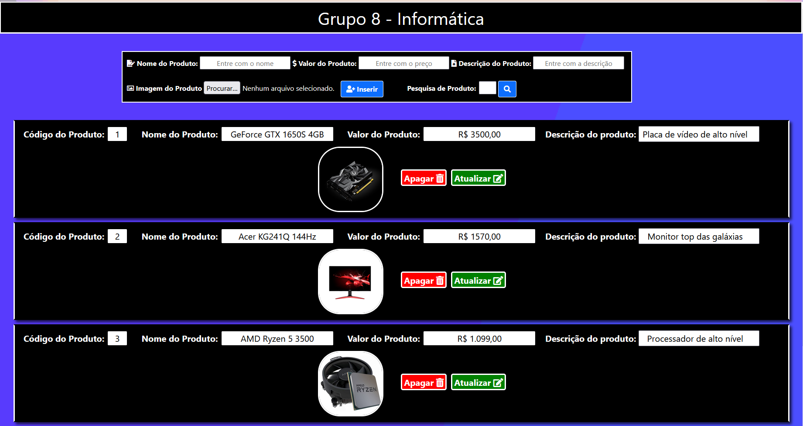

# CRUD - Informática :file_folder:
:bookmark_tabs: **Mostrando um pouco do CRUD de Informática do Grupo 8 com deploy no Azure**

:heavy_exclamation_mark: **Este conteúdo faz parte de um cronograma educacional, e foi uma tarefa solicitada para todos os alunos...**

## Membros do Grupo 8 :beginner:

:boy: **- Lucas Alves Moreira**

 **GitHub - (https://github.com/LucasAlvesM)**

:boy: **- Lucas Galdino**
 
 **GitHub - (https://github.com/LucasGaldinno)**

:boy: **- Maurício Alves Moreira**

 **GitHub - (https://github.com/MauricioAlvesM)**

:boy: **- Vitor Geovani** 

 **GitHub - (https://github.com/VitorGeovani)**

:boy: **- Tiago Soares** 

 **GitHub - (https://github.com/Tiagogtr)**

:boy: **- Ryan Marinho**

 **GitHub - (https://github.com/ryandcmv)**

## :information_source: Especificações do Projeto:

**Neste projeto utilizamos o Node.js, MySQL e o Azure com o Debian 10 "Buster" para realizarmos um CRUD, dividindo as partes do trabalho em Front-End, Back-End, Banco de Dados e Máquina Virtual. A ideia deste CRUD é simularmos uma Loja de Informática, onde são registrados os produtos, que no nosso caso possuem, código, nome, valor e descrição do produto.**

## 📌 Recursos usados neste projeto:

</img> **Visual Studio Code -  (https://code.visualstudio.com/Download)**

</img> **NodeJS - (https://nodejs.org/en/)**

</img> **Microsoft Azure -  (https://azure.microsoft.com/pt-br/)**

## :information_source: **Acesse nossa demo no Azure --> (http://crud-informatica.eastus.cloudapp.azure.com/origlistaaz.html)**

## :information_source: **Comandos importantes:**
### 📍 **Instala as dependências**
**sudo npm install**

### 📍 **Inicia um projeto**
**sudo npm init**

### 📍 **Roda o projeto**
**sudo node index.js &**

## **Imagem Demo do nosso projeto:**

  
  

